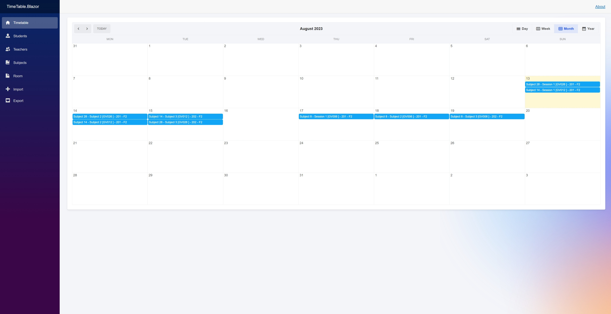

The project support timetable for small school implement by Blazor Server, SQLite, [Radzen](https://blazor.radzen.com/)



Note feature:

- Students
  - View (Support filter - Done)
  - Create (TBC)
  - Update (TBC)
  - Delete (TBC)
- Teacher
  - View (Support filter - Done)
  - Create (TBC)
  - Update (TBC)
  - Delete (TBC)
- Subject
  - View (Support filter - Done)
  - Create (TBC)
  - Update (TBC)
  - Delete (TBC)
- Room
  - View
  - Create (TBC)
  - Update (TBC)
  - Delete (TBC)
- Time Table
  - View (TBC - can view data from import)
  - Create (TBC)
  - Edit (TBC)
- Import (Done Import using CSV file - file refer as [`TimeTable.Blazor\Template`]) - TBC Validation input.
  - Student
  - Teacher
  - Room
  - Subject
  - Timetable
- Export timetable to CSV (BTC)

How to run the project.

1. Install [.NET 7](https://dotnet.microsoft.com/en-us/download) (for Build apps - SDK or ASP.NET Core Runtime 7.0.10)

2. Run command create database.

```Powershell
update-database ## Create database
## OR
dotnet ef database update

## Start application
dotnet run
```

Noted: **The project support dev container and can run in workspace**.